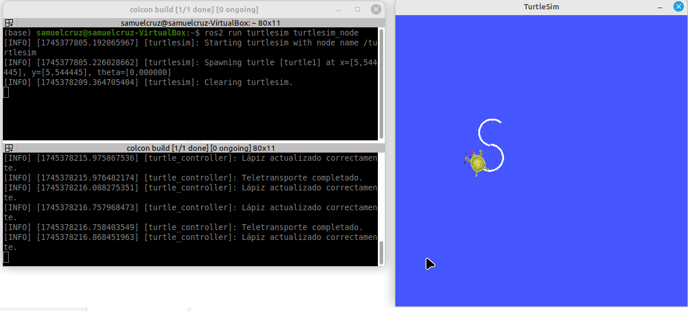
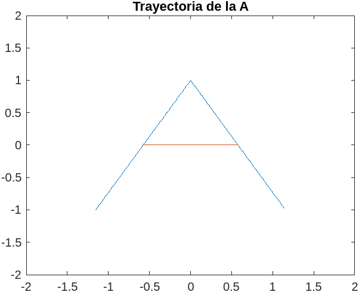

# Laboratorio No. 01 - 2025-I - Robótica de Desarrollo, Intro a ROS 2 Humble - Turtlesim
El objetivo primordial de esta práctica de laboratorio es familiarizarse con el entorno básico de ROS2, en particular con el nodo Turtlesim; para ello, este nodo se conectó con un archivo Python que permite el control de movimiento de una tortuga instanciada en dicho nodo; en primera instancia mediante la creación de un workspace de ROS2 a través de los siguientes comandos en la terminal de Linux:

```bash
mkdir -p ~/Laboratorio_Robotica/ros2_ws/turtlesim_ws/src
cd ..
colcon build
source /opt/ros/humble/setup.bash
```

Una vez creado el workspace, con ROS2 se creó un paquete que genera el código en Python que permite efectuar la conexión con el nodo Turtlesim:

```bash
cd ~/Laboratorio_Robotica/ros2_ws/turtlesim_ws/src
ros2 pkg create --build-type ament_python my_turtle_controller
```

A partir de este paquete, se creó un archivo ``move_turtle.py`` en la carpeta ``my_turtle_controller/my_turtle_controller/`` con el cual se inicializó la comunicación con el nodo Turtlesim mediante la sección del código ``rclpy.spin(node)``. Consiguientemente, se implementaron funciones en la clase ``TurtleController`` que regulan el movimiento de la tortuga mediante la interacción con el teclado.

Una vez se completaron todas las funciones del archivo ``move_turtle.py``, se guardaron los cambios y se retornó a la raíz del workspace para compilar el código y ejecutarlo:

```bash
cd ~/Laboratorio_Robotica/ros2_ws/turtlesim_ws
colcon build
source install/setup.bash
ros2 run my_turtle_controller move_turtle
```

A continuación se explica con mayor detalle cada una de las funciones implementadas para el control de movimiento de la tortuga.

## Control del nodo Turtlesim con el teclado

Para el control del nodo Turtlesim con las teclas, primero se implementó un hilo adicional que se encarga unicamente de escuchar el teclado, luego se creó la función ``listen_keyboard()`` que detecta la tecla que se presionó, esta información se guarda primordialmente en la variable ``key`` y posteriormente se usa en una secuencia de condicionales para modificar el movimiento de la tortuga; sin embargo, en el caso de las flechas, al ser teclas especiales, la información no se puede guardar en una sola variable sino que el sistema envía una secuencia de información que debe ser almacenada en dos variables adicionales para codificar la tecla que se presionó, por lo cual, la información se guarda en las variables ``key2`` y ``key3`` que se encargan de ubicar la región de las teclas especiales y decodificar la flecha específica que se presionó. En cuantó al movimiento, para el caso de las flechas, la flecha superior e inferior fijan la velocidad lineal de la tortuga en 2 y -2 unidades/s y la velocidad angular en 0 rad/s respectivamente para que la tortuga solo avance o retroceda, mientras que las teclas derecha e izquierda alternan el proceso y fijan la velocidad angular en 2 rad/s y la velocidad lineal en cero, para que la tortuga solo gire a la derecha o a la izquierda. En el caso del movimiento, accionado por letras, se requiere generar funciones específicas que dibujen la trayectoria de la tortuga. 

## Generación de Trayectorias

Para la generación de trayectorias, primero se creó una función paramétrica en Matlab que dibujaba la curva que describe las letras iniciales de los nombres de cada uno de los integrantes de trabajo, luego, en el código se fijaron una serie de puntos iniciales para ubicar la tortuga y que esta empiece a dibujar cada una de las iniciales. Una vez se tenían estos puntos, se variaba la velocidad líneal y angular de la tortuga de tal forma que en un intervalo menor a 2 segundos, la tortuga pudiera dibujar el contorno de la letra deseada acorde a la función implementada en Matlab, para ello se tiene en cuenta que el radio de una circunferencia dibujada por la tortuga en términos de su velocidad lineal y angular viene dado por:

$$r = \frac{v_t}{\omega_t}$$

A su vez, los desplazamientos líneales y angulares de la tortuga en términos de sus parámetros esenciales vienen dados por:

$$\Delta x_t = v_t*\Delta t$$
$$\Delta \theta_t = \omega_t*\Delta t$$

Donde $\Delta t$ se calcula con el parámetro ``time.time()`` que cuenta el tiempo de ejecución del programa desde que se compiló y el atributo ``self.last_key_time`` que se actualiza con el tiempo que marca el primer parámetro cada vez que se presiona la tecla. Los intervalos para mover la tortuga tanto con las letras de las iniciales como con las flechas del teclado se fijaron en 2 segundos para evitar que la tortuga se mueva infinitamente tras la pulsación única de alguna flecha, a su vez este tiempo es suficiente para que la tortuga dibuje cada una lass letras deseadas.

Un factor a tener en cuenta, es que en algunas letras como la "A" para agilizar el proceso de dibujo y evitar que la tortuga se desplace por zonas que ya recorrió, esta se teletransportó a otro punto lejano a la trayectoria inicialmente recorrida, a fin de que la tortuga terminará de dibujar la totalidad de la letra, para ello se empleó la función ``teleport_to()`` que utiliza el cliente ``TeleportAbsolute`` para desplazar la tortuga a unas coordenadas x e y, y una orientación $\theta$ determinadas por el usuario. El cliente por sí solo se encarga de teletransportar la tortuga a la configuración deseada, pero durante el proceso quedará un rastro del lápiz de la tortuga que une el punto de origen y el punto de destino de la teletransportación. 

Para solucionar el anterior problema, se empleó el cliente ``SetPen`` que modifica las propiedades del lápiz de la tortuga y lo desactiva o activa según desee el usuario, este cliente se usa en la función ``set_pen()`` para efectuar la petición de apagar el lápiz antes de efectuar el teletransporte y volverlo a encender con las características de compilación iniciales una vez se completa el teletransporte en la función ``after_teleport()``. La teletransportación no solamente se debe hacer en la letra "A" sino que también se debe hacer en la letra "S", para corregir errores de posición y orientación debidos a la latencia del simulador tras el dibujo de la parte superior, en este caso también es importante apagar y prender el lápiz para no dañar el trazado ya hecho, a diferencia de la "A" donde esta técnica se usaba para no añadir trazos innecesarios.

Una última funcionalidad que es importante mencionar, es la implementación de la letra "R" que resetea el entorno de visualización, es decir, limpia el trazado de la tortuga, por medio de la funcion ``clear_background()`` que utiliza el cliente ``Empty``; la devuelve al punto de origen (5.5,5.5,0) y la deja quieta fijando su velocidad linear y angular a cero. Esta funcionalidad resulta de gran utilidad para eliminar los trazos que impiden distinguir los resultados en las últimas pruebas de los obtenidos en las primeras pruebas.

### Trayectoria de la S

La "S" se puede considerar como dos segmentos de circunferencia, el primero dibuja la sección superior de la "S" y engloba la curva antihoraria comprendida entre los 45° y los 270° descritos por el vector de trazado con origen en su centro, mientras que el segundo segmento dibuja la sección inferior y engloba la curva comprendida comprendida entre los 270° y los 495° de una curva trazada en sentido horario con un vector con origen en su centro, si consideramos que el radio de la primera curva es 0.5 unidades y su centro está desplazado 0.5 unidades verticales con respecto a la posición inicial de compilación de la tortuga, mientras que si el radio de la segunda es tambien 0.5 unidades, pero su centro está desplazado -0.5 unidades verticales con respecto al punto anterior, se puede escribir la siguiente función parámetrica que representa la curva que mejor se adapta a lo que queremos:

$$r(t) = \begin{cases} \langle 0.5cos(t),0.5sin(t)+0.5\rangle, \frac{\pi}{4} \leq t \leq \frac{3\pi}{2} \\ 
\langle 0.5cos(t),-0.5sin(t)-0.5 \rangle, \frac{3\pi}{2} \leq t \leq \frac{11\pi}{4} \end{cases} $$

Ya con está expresión matemática, podemos escribir una función en Matlab para generar la trayectoría deseada:

```matlab
t2 = pi/4:0.1:11*pi/4;
c2x = 0.5*cos(t2).*(t2<=3*pi/2)+0.5*cos(t2).*(t2>3*pi/2);
c2y = (0.5*sin(t2)+0.5).*(t2<=3*pi/2)+(-0.5*sin(t2)-0.5).*(t2>3*pi/2);
figure
plot(c2x,c2y)
xlim([-2 2])
ylim([-2 2])
title("Trayectoria de la S")
```

<p align="center">
   <br> 

Ahora bien, para extrapolar estos resultados al control de movimiento de la tortuga de ROS2, en primer lugar debemos hacer la configuración inicial de la tortuga, para ello primero escogemos una posición (x,y) arbitraria para ubicar la tortuga y empezar a dibujar. Como la tortuga se controla por velocidad, se puede asemejar al vector de velocidad de la curva parámetrica, recordemos que este vector es tangente a la curva y en el caso de las circunferencias también es perpendicular al vector de trazado, por ende la orientación inicial de la tortuga deberá ser perpendicular al vector inical de posición, como en este caso el vector inicia en $\pi/4$ radianes, la orientación debe ser $3\pi/4$ radianes. Después fijamos las velocidades lineales y angulares junto con los tiempos de acuerdo a las ecuaciones expuestas en la sección anterior.

Dado que la latencia del simulador no es muy buena, las ordenes que se le dieron a la tortuga no se suelen ejecutar a cabalidad y esta termina un ciclo en una una posición y pose indeseada, por lo cual resulta necesario hacer una serie de correciones con la función ``teleport_to`` a fin de asegurarse que la posición de la tortuga, efectivamente sea el punto medio de ambos centros de circunferencia y su orientación para el sgundo ciclo sea 0 radianes. Esto asegura una "S" con una forma casi uniforme en cada iteración que se realice:

<p align="center">
   <br> 

### Trayectoria de la A

La "A" se puede considerar como dos segmentos de recta simétricos con respecto a la vertical que se cruzan en un solo punto y un segmento adicional de recta horizontal que los conecta aproximadamente en el punto medio de su longitud. Si consideramos que el extremo inferior de la A se encuentra en la coordenada (-1,1) y la pendiente de los segmentos de recta está dado por $\pm(tan(\pi/3))$, se puede escribir la siguiente correspondencia a trozos para dibujar el contorno de la letra:

$$g(t) = \begin{cases} \sqrt{3}t+1 , \frac{-2}{\sqrt{3}} \leq t < 0 \\ 
-\sqrt{3}t+1 , 0 < t \leq \frac{2}{\sqrt{3}} \\ 
0, t \leq 0
\end{cases} $$

Al igual que en el caso anterior, con está expresión matemática podemos escribir una función en Matlab para generar la trayectoría deseada:

```matlab
t3 = -2/sqrt(3):0.01:2/sqrt(3);
c31x = t3.*(t3<=2/sqrt(3));
c31y = (sqrt(3)*t3+1).*(t3<=0)+(-sqrt(3)*t3+1).*((0<t3) & (t3<=2/sqrt(3)));
c32x = (t3+1/sqrt(3)).*(t3<=0);
c32y = 0.*(t3<=0);
figure
plot(c31x,c31y,c32x,c32y)
xlim([-2 2])
ylim([-2 2])
title("Trayectoria de la A")
```

<p align="center">
   <br> 

Las consideraciones para la implementación en ROS2 son muy similares al caso anterior, con la excepción de que en este caso la correspondencia a trozos se puede asociar directamente con el movimiento de la tortuga teniendo precaución en la orientación ya que está se le expresa a la tortuga en radianes, por lo cual se le debe aplicar la tangente inversa a las pendientes para poder obtener dicho parámetro, además como se puede apreciar en Matlab para dibujar la horizontal se debe usar si o si la teletransportación dado que se genera un trazo discontinuo. 

<p align="center">
   <br> 

### Trayectoria de la C

La "C" se puede considerar como un segmento de circunferencia que engloba la curva antihoraria comprendida entre los 60° y los 300° descritos por el vector de trazado con origen en el centro de la circunferencia, si consideramos que el centro de la misma es el origen y su radio es equivalente a una unidad, se puede escribir la siguiente función parámetrica que representa la curva que mejor se adapta a lo que queremos:

$$r(t) = \langle cos(t),sin(t)\rangle, \frac{\pi}{3} \leq t \leq \frac{5\pi}{3}$$

La función hecha en Matlab para generar la trayectoría es la siguiente:

```matlab
t = pi/3:0.1:5*pi/3;
cx = cos(t);
cy = sin(t);
plot(cx,cy)
xlim([-2 2])
ylim([-2 2])
title("Trayectoria de la C")
```

<p align="center">
   <br> 

En este caso, la latencia del simulador no afecta mucho la generación de la trayectoria, por lo que la "C" generada será muy similar en casi todas las pruebas realizadas. En cuanto a la orientación y otras consideraciones de movimiento, se toman las mismas medidas que para la "S" y se verifica que esta sea perpendicular al vector de posición, en este caso la orientación inical se fija en $5\pi/6$.

<p align="center">
   <br> 
