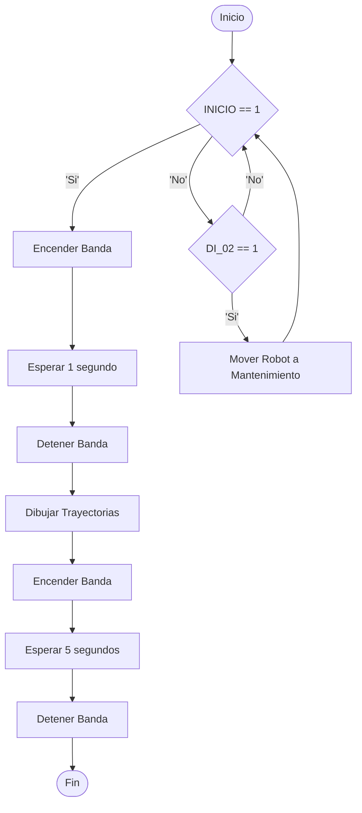
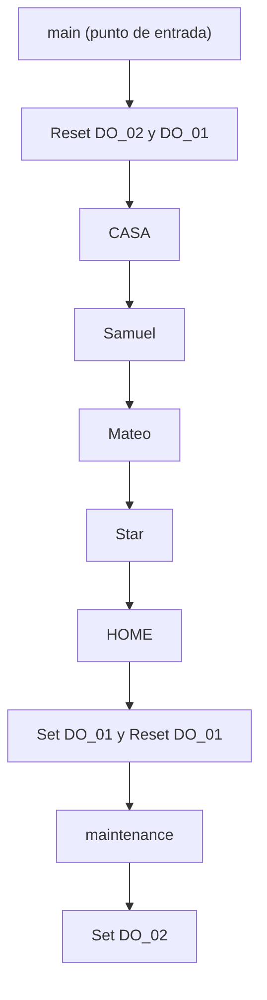

# Laboratorio No. 02 - 2025-I- Robótica Industrial - Trayectorias, Entradas y Salidas Digitales
El objetivo primordial de esta práctica de laboratorio es aprender a controlar el manipulador ABB IRB 140 mediante las funciones proporcionadas por RobotStudio e interactuar con el módulo de entradas y salidas digitales dispuesto en el controlador IRC5, para ello se propone escribir en un tablero los nombres de cada uno de los integrantes del grupo y el dibujo de una estrella de 5 puntas. 

## Diseño de la Herramienta y el WorkObject

En este sentido, primero se generó una simulación de toda la secuencia del Robot y la banda en el entorno de RobotStudio para verificar el funcionamiento adecuado del diseño antes de ponerlo a prueba en el robot real, para esta simulación fue necesario diseñar una herramienta.

El diseño de la herramienta se basó en las medidas del flange del robot en el datasheet, también se tuvo en cuenta el tamaño de un resorte para tener un margen de error, de manera que al escribir el marcador pueda tener un moviento más flexible impidiendo así que la herramienta se rompa por un sobresfuerzo. El diseño final obtenido es el siguiente:

  

Los agujeros para los tornillos se dejaron de un diametro de 6.5 mm, la longitud del espacio para el marcador y el resorte es de 11 mm, además de esto, se seleccionó un ángulo de 130 grados, evitando asi ángulos de 0, 45 y 90 grados que pudiesen generar singularidades, problemas de control de orientación y comportamientos mecánicos no deseados.

  

Para la simulación en RobotStudio, se le pusó una punta simulando la punta del marcador, con el objetivo de tener un TCP más preciso:

  

con ello y teniendo en cuenta las tolerancias que se deben considerar con la impresión en 3D, se logró obtener la siguiente herramienta:

  

Después de que se diseñó y se calibró la herramienta, se escogió un WorkObject para dibujar los nombres y la estrella de 5 puntas, los criterios de elección fueron su planitud para no modificar mucho la trayectoria deseada, su rigidez para no deformarse con la presión que ejerce el marcador y sus dimensiones para que una de ellas no superara el ancho de la banda presente en el laboratorio, es decir 20 cm. Con todo esto presente, la elección final fue un tablero acrílico de 20x28cm.

## Secuencia General de Movimientos

Una vez se tienen bien definidos todos los objetos que intervienen en la simulación, se importan sus respectivos modelos CAD a la estación de trabajo, se ubican en posiciones muy similares a las del laboratorio y se vinculan de ser necesario al modelo deseado del robot ABB, con lo cual toda la vista de planta del entorno de la smulación queda de la siguiente manera:

     

En el caso de la banda transportadora, no se conocían las dimensiones exactas de la banda del laboratorio, por lo cual, se eligió el modelo CAD más pequeño de las bibliotecas por defecto de Robot Studio.

Posteriormente, se definió la lógica general para que toda la simulación cumpla con los requerimientos del decorado, esto se logra encendiendo primero la banda para que transporte el pastel hasta la posición de decorado; luego deteniéndola para que el robot dibuje y volviéndola a encender después de que el robot terminé su decoración. A su vez, se añade una opción para ubicar el robot en una posición de mantenimiento en la cual se facilite la extracción e instalación de su herramienta de trabajo. Todo esto se resume en el siguiente diagrama de flujo: 

Para mover el WorkObject en RobotStudio se usa el Linear Mover de los Smart Components y se vincula al pastel para desplazarlo en el eje Y a una velocidad de 100 mm/s, el movimiento se detiene cuando finaliza el conteo de un Timer de 1 segundo o 5 segundos que se activa con la señal de inicio de movimiento, bien sea al inicio o al final de la rutina.

Para evitar que la rutina inicial de movimiento de la banda se ejecutara simultáneamente a la rutina final, se emplearon una serie de bloques lógicos que garantizaban que la secuencia final únicamente se iniciara cuando el testigo de finalización del decorado se encendiera y ya hubiera finalizado la rutina inicial de movimiento.

Estas consideraciones se ven reflejadas en el siguiente diagrama de bloques para la lógica general de la simulación:

     

Las señales de los Timer y del Inicio no siempre prevalecían en el tiempo sino que eran pulsos, por lo cual se requirió del uso de Latches para detectar los flancos de subida de dichas señales y almacenarlos en memoria para poder usarlas posteriormente, una vez se terminaban de usar, estos se reseteaban con señales internas en la rutina para evitar futuros problemas en la misma rutina o en ejecuciones posteriores. 

## Generación de trayectorias

Para generar las trayectorias del decorado, se tuvieron que señalar los puntos por los cuales iba a pasar la herramienta de trabajo y guardar en el marco de referencia del WorkObject para el caso de los nombres, o en el marco de referencia global para el caso de las posiciones de Home y Mantenimiento, esto con el fin de evitar que estos últimos dos puntos cambiaran de posición cuando se activara el movimiento de la banda transportadora.

A su vez, se garantizó que el marco de referencia de cada punto tuviera la misma orientación que el TCP para evitar que el robot quedará en configuraciones no deseadas al momento de moverse.

     

Después de tener los puntos base, se utilizan las instrucciones "MoveJ, MoveC, y MoveL", el MoveJ fue usado para pasar de una letra a la otra, puesto que tenia que subir 20 mm después de realizar la letra, con el objetivo de no tener trazos erróneos al momento de pasar de un a letra a la otra. MoveC se uso para las curvas, y MoveL para las lineas rectas, a continuación se muestra la rutina para una letra:

  

La rutina que se observa describe una "S", se utiliza el MoveJ para llegar a la posición inicial de la trayectoria, y a partir de ahí hace un MoveC para la primera curva de la S, luego realiza dos MoveL y finaliza con un MoveC. Para las otras letras se siguió el mismo procedimiento con los puntos y luego uniendolos por medio de las instrucciones "Move", el siguiente diagrama representa la secuencia del "main()" del programa:

