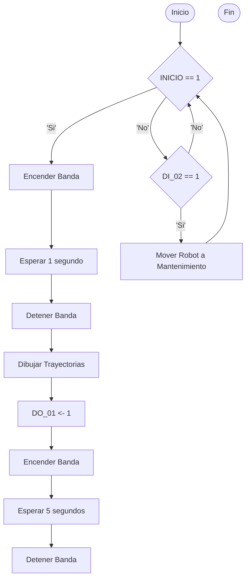

# Laboratorio No. 02 - 2025-I- Robótica Industrial - Trayectorias, Entradas y Salidas Digitales
El objetivo primordial de esta práctica de laboratorio es aprender a controlar el manipulador ABB IRB 140 mediante las funciones proporcionadas por RobotStudio e interactuar con el módulo de entradas y salidas digitales dispuesto en el controlador IRC5, para ello se propone escribir en un tablero los nombres de cada uno de los integrantes del grupo y el dibujo de una estrella de 5 puntas.

## Diseño de la Herramienta

## Secuencia de Movimientos

