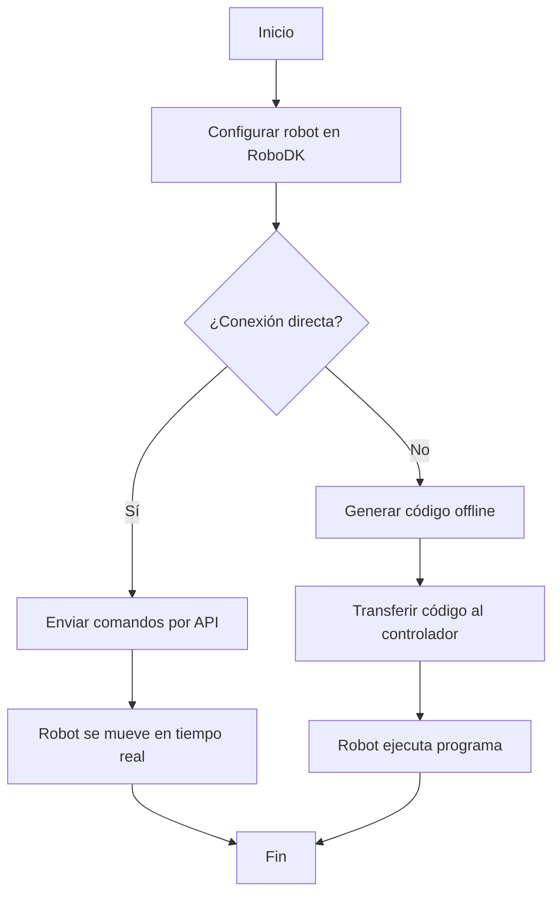

# Laboratorio No. 03 - 2025-I - Robótica Industrial - Análisis y Operación del Manipulador Motoman MH6

En esta práctica de laboratorio se busca comprender el funcionamiento del Motoman MH6 e identificar las características fundamentales para la operación manual y la ejecución de simulaciones en RoboDK, a fin de realizar una comparación técnica entre el manipulador Motoman MH6 y el ABB IRB140 y sus respectivos software de control RoboDK y RobotStudio.

## Cuadro Comparativo Motoman MH6 y ABB IRB140
| Característica         | Motoman MH6                                                                                   | ABB IRB 140                                                                                 |
|------------------------|-----------------------------------------------------------------------------------------------|---------------------------------------------------------------------------------------------|
| Fabricante             | Yaskawa Motoman                                                                               | ABB                                                                                         |
| Modelo                 | MH6                                                                                           | IRB 140                                                                                     |
| No. grados de libertad | 8                                                                                             | 6                                                                                           |
| Carga máxima           | 6 kg                                                                                          | 6 kg                                                                                        |
| Peso del robot         | 130 kg + Riel                                                                                 | 98 kg                                                                                       |
| Alcance                | 1422 mm                                                                                       | 810 mm                                                                                      |
| Velocidad máxima       | 2600 mm/s                                                                                     | 1000 mm/s                                                                                   |
| Potencia máx           | 1.2 kW                                                                                        | 0.44 kW                                                                                     |
| Aplicaciones típicas   | Soldadura, embalaje, ensamblaje, manipulación, carga/descarga, etc.                          | Manipulación de materiales, ensamblaje, servicio de máquinas, laboratorio, etc.            |

## Configuraciones de Home para Motoman MH6
Home1 y Home2 son dos posiciones predefinidas que son posiciones de referencia para el robot, a pesar de ambas ser "Home" cumplen funciones diferentes. En ocasiones tambien se habla de Home0, que puede ser usada para transporte, almacenamiento o mantenimiento pero no es documentada como Home1 o Home2.
### Home1

  

Normalmente el Home1 es la posición de referencia principal, usualmente viene preconfigurada por el fabricante. Se utiliza como un punto de seguridad para inicializar el robot, hacer un reinicio del sistema o posicionarlo en una postura más compacta, como se puede observar en la imagen. Suele estar alejada del área de trabajo lo que puede ayudar a evitar colisiones cuando se enciende o reinicia.

Las condiciones articulares para Home1 son las siguientes:

  

### Home2

  

Por otro lado, el Home2 es una posición alternativa con la que viene el robot y puede ser definida por el usuario, es comúnmente usada como posiciones iniciales de distintos ciclos de trabajo, como podría ser la postura que facilite el inicio de una rutina o de un proceso, en este caso esta extendido el robot, facilitando de alguna forma el iniciar las rutinas para las trayectorias polares. Al ser personalizable puede usarse según la conveniencia del caso, como una posición para calibrar herramientas o cambio de las mismas.

  

Como tal no hay una posición mejor puesto que depende del uso para el que se requiera, una posición puede ser mejor para unas aplicaciones pero peor para otras, por lo que es muy relativo, pero si se quiere elegir, podría decirse que Home1 puede llegar a ser mejor debido a que es una posición mas compacta del robot en la que ocupa menos espacio.
## Movimientos manuales Motoman MH6

Para realizar movimientos manuales, el procedimiento a seguir es el siguiente:

Primero claramente se encience el robot y el controlador, luego en el teach pendant se debe mover el interruptor a la posición de "Teach", tiene una mano encima de donde dice Teach para reconocerla, luego se habilitan los servomotres, presionando Servo ON READY la cual esta entre SIMPLE MENU y ASSIST, luego se debe mantener el botón de hombre muerto para permitir el movimiento, este se encuentra en la parte de atrás del teach pendant.

Para los cambios de modos de movimiento, se presiona el botón "COORD" y luego se puede observar las distintas opciones de las que dispone, como pueden ser Base con las coordenadas cartesianas, Joint para mover por articulaciones, tool para mover respecto al TCP y User para mover respecto a unas coordenadas definidas por el usuario.

Para realizar estos movimientos en Joint y en las coordenadas cartesianas, se usan los botones "X-, X+, Y-, Y+, Z-, Z+" con distintas letras debajo de ellas para mover distintas articulaciones, como el robot tiene más grados de libertad debido al riel y a la utilidad que gira, se usan todos los botones, si no se tuvieran, habrian 4 botones de movimiento que no harían nada.

En la imagen se pueden apreciar los botones mencionados de configuración y de movimiento.

  

## Niveles de velocidad para Motoman MH6

En el Motoman hay 8 velocidades a las que se puede acceder mediante el Flex Pendant, sus características principales se resumen en la siguiente figura:

     

Ahora bien, si se requiere cambiar el límite general de velocidad para el Motoman, primero se debe colocar la llave en la posición de "Teach", posteriormente se debe presionar el botón "MAIN MENU". Una vez la pantalla se encuentre en el menú, se selecciona “Robot”, luego se entra a “Override” y se emplean las teclas de dirección para seleccionar el valor de limitación. Por último se usan las teclas [+]/[-] para aumentar o disminuir la velocidad y se presiona "ENTER" para confirmar el nuevo valor. Para verificar el nivel de velocidad máximo se debe revisar la parte superior del Flex Pendant donde aparece el valor actualizado de override.

## Funcionalidades de RoboDK

RobotDK es un software de simulación y programación para robots industriales.
Con este software es posible simular, optimizar y programar robots de distintas marcas sin necesidad de tener que hacerlo directamente con el controlador físico del robot.

Dentro de las principales aplicaciones de RobotDK están:

- Programación offline : Permite crear los programas para el robot sin necesidad de detener la producción y puede importar distintas geometrías CAD, para generar trayectorias en ellas por ejemplo. Esto podría ser usado para corte, pintura o soldadura.
- Su interfaz es compatible con una gran variedad de marcas, debido a ello se pueden importar muchos robots a RobotDK con distintas características según la necesidad, entre las marcas están ( ABB, KUKA, Yaskawa Motoman, Fanuc, UR, etc.)
- Es posible visualizar y simular los movimientos del robot antes de ejecutarlos en el robot real, también cuenta con detección de colisiones y límites articulares.
- Tiene aplicaciones de manufactura avanzada como puede ser soldadura por arco, paletizado y fresado.

La comunicación de RoboDK con el manipulador puede realizarse con programación offline y comunicación en tiempo real, en el primer caso, RoboDK genera el código nativo del robot, en el laboratorio anterior este código nativo era RAPID, en este caso es INFORM, ese archivo se transfiere al controlador del robot por medio de USB o Ethernet y el robot lo ejecuta, el archivo usado es un ".JBI".

En la comunicación en tiempo real RoboDK puede conectarse directamente al robot vía Ethernet usando su API, se pueden controlar los movimientos, leer sus sensores y cambiar las velocidades todo mediante un script, que puede ser de Matlab, C++, Python, etc.
Puede ser muy útil si se quiere tener una gran cantidad de datos en tiempo real del robot.

Por otro lado, lo que hace RoboDK para mover el manipulador es bastante impresionante, por un lado debe calcular la cinemática directa o inversa según el robot lo requiera, luego debe generar las trayectorias y convertirlas en el código específico del robot, para que el robot lo entienda, y luego utiliza alguna de las dos comunicaciones mencionadas para enviar el código al robot.

## Comparación RoboDK y RobotStudio

Tanto RobotStudio como RoboDK son software que permiten programar trayectorias y rutinas para cargarlas a distintos modelos de robot industriales. Sin embargo, RobotStudio está enfocado en robots de la marca ABB, mientras que RoboDK permite programar robots de distintas marcas manufactureras. A su vez, RoboDK cuenta con la facilidad de que permite generar trayectorias con distintos lenguajes de programación como C++ y Python, mediante el uso de API's, mientras que RobotStudio únicamente permite programar movimientos y rutinas con RAPID.

En cuanto al apartado visual, RobotStudio ofrece un entorno mucho más atractivo, dado que se asemeja mucho más al ambiente real en el cual se puede encontrar el robot, cuenta con un piso bien definido, herramientas de navegación por el entorno y cambios de orientación en la cámara de visualización. En cambio, RoboDK ofrece un entorno mucho más simple donde hay un espacio abstracto en el cual se pueden configurar los elementos de la operación; a su vez las texturas y los detalles del robot son mucho más generales y simples que en RobotStudio; este último apartado es una gran desventaja para RobotStudio en el caso de los computadores con bajos recursos, dado que para un correcto y fluido funcionamiento de las simulaciones se requieren de altas especificaciones en el hardware del computador.

Por último, pero no menos importante, se encuentra el apartado de la operabilidad del usuario y es que si bien es cierto que RoboDK cuenta con menos herramientas para la modificación de trayectorias y su catalogo de Smart Components es más reducido que en RobotStudio, su uso es más intuitivo y la inclusión de las herramientas anteriores en el programa es relativamente más fácil de implementar que en RobotStudio, esto incluye la importación de modelos CAD externos y la carga del programa al robot físico. 

Estas consideraciones se resumen en la siguiente tabla:

|                         **Item**                        |   **RobotStudio**   |      **RoboDK**      |
|:-------------------------------------------------------:|:-------------------:|:--------------------:|
|                       Versatilidad                      |        Media        |         Alta         |
|                       Intuitividad                      |        Media        |         Alta         |
|         Estética visual de la  interfaz gráfica         |         Alta        |      Media/Baja      |
|               Consumo de recursos  de CPU               |   Consumo Elevado   |   Consumo Moderado   |
|           Disponibilidad de  Smart Components           |         Alta        |         Media        |
|         Simplicidad al importar  objetos CAD externos        |         Alta        |      Media      |
|   Apertura a diversidad de  lenguajes de programación   |         Baja        |         Alta         |
|          Facilidad de creación  de trayectorias         |        Media        |         Alta         |
| Herramientas para modificar  posiciones en trayectorias | Alta Disponibilidad | Disponibilidad Media |
|        Simplicidad de conexión  con robot físico        |         Baja        |         Alta         |

En resumidas cuentas, ambos software cuentan con muchas ventajas y desventajas para la programación de robots industriales, por lo que la elección de uno o de otro puede variar según aspectos como la disponibilidad de robot físicos, especificaciones de los computadores empleados para programar y validaciones subjetivas del programador final. 

## Generación de Trayectorias Polares

La figura electa para dibujar con el manipulador es la silueta de una mariposa simétrica con respecto a su eje vertical, para ello, se parte de un diseño inicial con la siguiente función en coordenadas polares:

$$r(\theta) = e^{sin(\theta)}-2cos(4\theta)$$

Esta función tiene el defecto de dibujar una mariposa simple con alas que sobresalen del círculo unitario centrado en el origen:

     

Para corregir los excesos en las alas, se calcula el valor máximo de la función con Matlab y se divide toda la función por el valor encontrado, en este caso es 4.0599. Esto permite inscribir la mariposa en una circunferencia centrada en el origen con radio arbitrario, escalando la función por un parámetro $A$.

Esta función tambien puede rotar alrededor del eje z con pasos de $90^\circ$ tan solo con añadir un parámetro $k$ al ángulo que opera al seno en la exponencial, de tal forma que se cumpla con la siguiente restricción:

$$k = \{\frac{n\pi}{2}/n \owns \mathbb{Z} \}$$

Con lo cual, si juntamos ambas correcciones a la función original, nos queda la siguiente expresión, con la cual controlamos el tamaño máximo de la mariposa con el parámetro $A$ y la orientación con el parámetro $k$:

$$r(\theta,A,k) = \frac{A}{4.0599}\left(e^{sin(\theta+k)}-2cos(4\theta)\right)$$

En este sentido, fijando el parámetro $A$ en 150 mm que es el radio máximo que ofrece el manipulador y fijando $k$ en $pi/2$ para que la simulación dibuje la mariposa con la orientación adecuada, nos queda la siguiente mariposa:
 

     

Para convertir la función polar a coordenadas cartesianas se emplean las siguientes relaciones:

$$x=rcos(\theta)$$
$$y=rsin(\theta)$$

Ahora bien para implementar esta trayectoria en Python y que esta se pueda cargar al robot se debe hacer uso de la librería ``robodk.robolink`` que es una API que comunica el cógico fuente de Python con el entorno de comunicación del Motoman y también se debe hacer uso de la librería ``robodk.robomath`` para poder implementar la función en coordenadas polares que dibuja la mariposa. Una vez se tengan importadas estas librerias, se debe inicializar el nodo del robot, definir parámetros de figura y relacionar las trayectorias polares a coordenadas cartesianas para poder moverlas con ``robot.MoveL()``. Dicha rutina se encuentra definida en el archivo ``Mariposa.py``

## [Video explicativo del trabajo realizado y simulación](https://drive.google.com/file/d/1dv9j6Z558zDxUwWrr6xU5W7V4v6KYOrM/view?usp=sharing)

## [Resultado en el Lab](https://drive.google.com/file/d/1agfuaRuySXaeZ-Lx5TB0GM83s2Mxc1Sw/view?usp=sharing)
