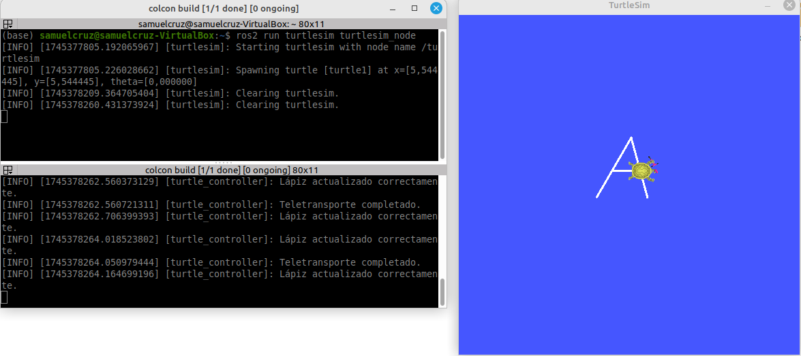
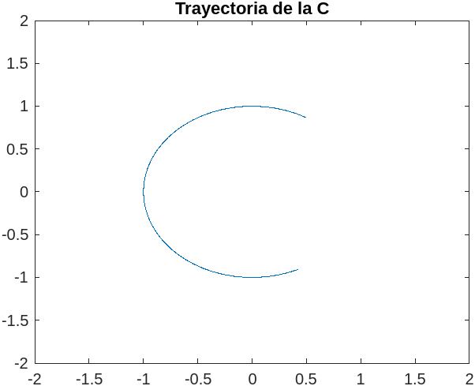
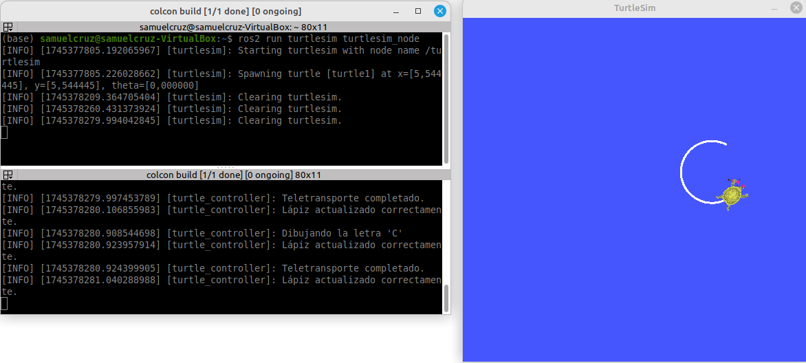

# Laboratorio No. 01 - 2025-I - Robótica de Desarrollo, Intro a ROS 2 Humble - Turtlesim
El objetivo primordial de esta práctica de laboratorio es familiarizarse con el entorno básico de ROS2, en particular con el nodo Turtlesim; para ello, este nodo se conectó con Python, en primera instancia mediante la creación de un workspace de ROS2 a través de los siguientes comandos en la terminal de Linux:

```bash
mkdir -p ~/Laboratorio_Robotica/lab_1/ros2_ws/src
cd ..
colcon build
source /opt/ros/humble/setup.bash
```

Una vez creado el workspace, con ROS2 se creó un paquete que genera el código en Python que permite efectuar la conexión con el nodo Turtlesim:

```bash
cd ~/Laboratorio_Robotica/lab_1/ros2_ws/src
ros2 pkg create --build-type ament_python my_turtle_controller
```

A partir de este paquete, se creó un archivo ``move_turtle.py`` en la carpeta ``my_turtle_controller/my_turtle_controller/`` con el cual se inicializó la comunicación con el nodo Turtlesim mediante la sección del código ``rclpy.spin(node)``. Consiguientemente, se implementaron funciones en la clase ``TurtleController`` que regulan el movimiento de la tortuga mediante la interacción con el teclado.

Una vez se completaron todas las funciones del archivo ``move_turtle.py``, se guardaron los cambios y se retornó a la raíz del workspace para compilar el código y ejecutarlo:

```bash
cd ~/Laboratorio_Robotica/lab_1/ros2_ws
colcon build
source install/setup.bash
ros2 run my_turtle_controller move_turtle
```

A continuación se explica con mayor detalle cada una de las funciones implementadas para el control de movimiento de la tortuga.

## Control del nodo Turtlesim con flechas

Para el control del nodo con las flechas del teclado, primero se implementó un hilo adicional que se encargara unicamente de escuchar el teclado, luego se creó la función ``listen_keyboard``

## Generación de Trayectorias
Para la generación de trayectorias, primero se creó una función paramétrica en Matlab que dibujaba la curva que describe las letras iniciales de los nombres de cada uno de los integrantes de trabajo, luego, en el código se fijaron una serie de puntos iniciales para ubicar la tortuga y que esta empiece a dibujar cada una de las iniciales. Una vez se tenían estos puntos, se variaba la velocidad líneal y angular de la tortuga de tal forma que en un intervalo menor a 2 segundos, la tortuga pudiera dibujar el contorno de la letra deseada acorde a la función implementada en Matlab, para ello se tiene en cuenta que el radio de una circunferencia dibujada por la tortuga en términos de su velocidad lineal y angular viene dado por:

$$r = \frac{v_t}{\omega_t}$$

A su vez, los desplazamientos líneales y angulares de la tortuga en términos de sus parámetros esenciales vienen dados por:

$$\Delta x_t = v_t*\Delta t$$
$$\Delta \theta_t = \omega_t*\Delta t$$

Donde $\Delta t$ se calcula con el parámetro ``time.time()`` que cuenta el tiempo de ejecución del programa desde que se compiló y el atributo ``self.last_key_time`` que se actualiza con el tiempo que marca el primer parámetro cada vez que se presiona la tecla. Los intervalos para mover la tortuga tanto con las letras de las iniciales como con las flechas del teclado se fijaron en 2 segundos para evitar que la tortuga se mueva infinitamente tras la pulsación única de alguna flecha, a su vez este tiempo es suficiente para que la tortuga dibuje cada una lass letras deseadas.

Un factor a tener en cuenta, es que en algunas letras como la "A" para agilizar el proceso de dibujo y evitar que la tortuga se desplace por zonas que ya recorrió, esta se teletransportó a otro punto lejano a la trayectoria inicialmente recorrida, a fin de que la tortuga terminará de dibujar la totalidad de la letra, para ello se empleó la función ``teleport_to`` que utiliza el cliente ``TeleportAbsolute`` para desplazar la tortuga a unas coordenadas x e y, y una orientación $\theta$ determinadas por el usuario. El cliente por sí solo se encarga de teletransportar la tortuga a la configuración deseada, pero durante el proceso quedará un rastro del lápiz de la tortuga que une el punto de origen y el punto de destino de la teletransportación. 

Para solucionar el anterior problema, se empleó el cliente ``SetPen`` que modifica las propiedades del lápiz de la tortuga y lo desactiva o activa según desee el usuario, este cliente se usa en la función ``set_pen`` para efectuar la petición de apagar el lápiz antes de efectuar el teletransporte y volverlo a encender con las características de compilación iniciales una vez se completa el teletransporte en la función ``after_teleport``. La teletransportación no solamente se debe hacer en la letra "A" sino que también se debe hacer en la letra "S", para corregir errores de posición y orientación debidos a la latencia del simulador tras el dibujo de la parte superior, en este caso también es importante apagar y prender el lápiz para no dañar el trazado ya hecho, a diferencia de la "A" donde esta técnica se usaba para no añadir trazos innecesarios.

Una última funcionalidad que es importante mencionar, es la implementación de la letra "R" que resetea el entorno de visualización, es decir, limpia el trazado de la tortuga, por medio de la funcion ``clear_background`` que utiliza el cliente ``Empty``; la devuelve al punto de origen (5.5,5.5,0) y la deja quieta fijando su velocidad linear y angular a cero. Esta funcionalidad resulta de gran utilidad para eliminar los trazos que impiden distinguir los resultados de las últimas pruebas de los resultados en las primeras pruebas.

### Trayectoria de la S

<p align="center">
   <br> 

<p align="center">
   <br> 

### Trayectoria de la A

<p align="center">
   <br> 

<p align="center">
   <br> 

### Trayectoria de la C

<p align="center">
   <br> 

<p align="center">
   <br> 
